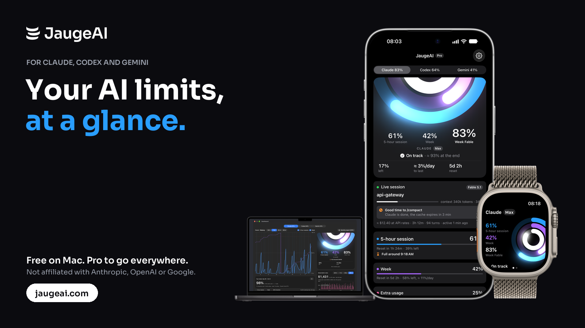
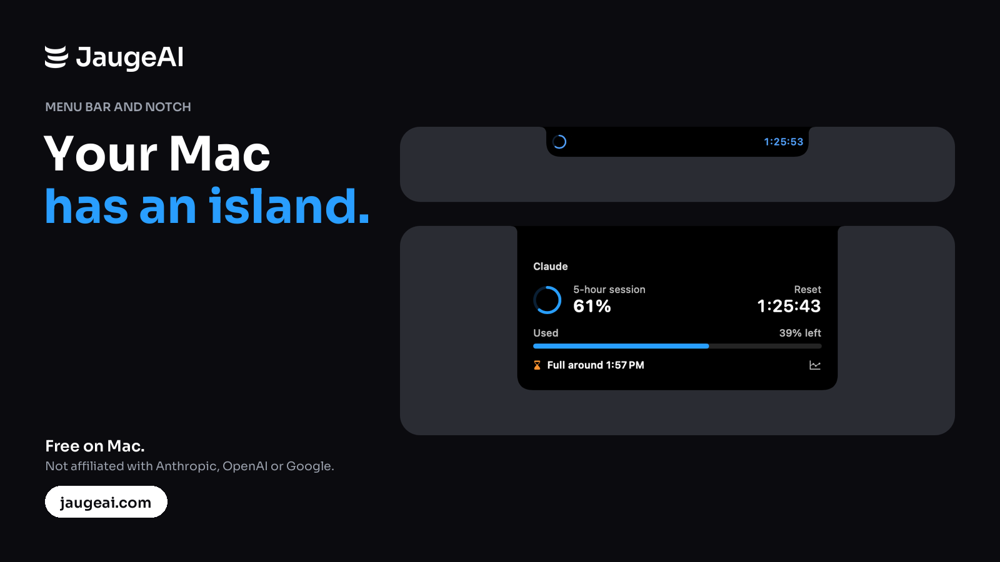
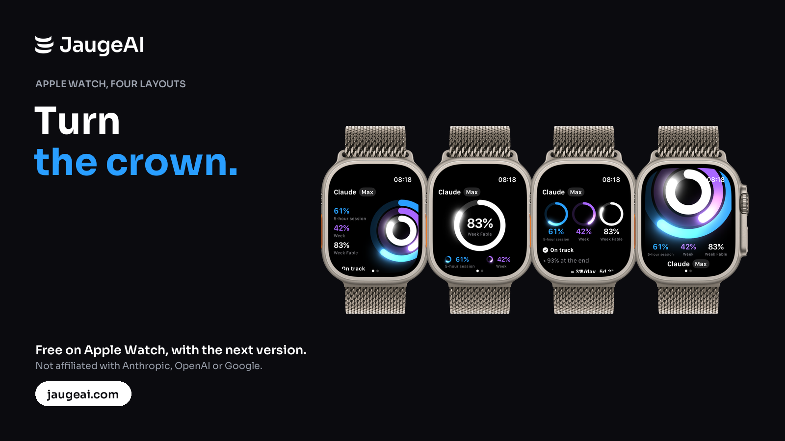
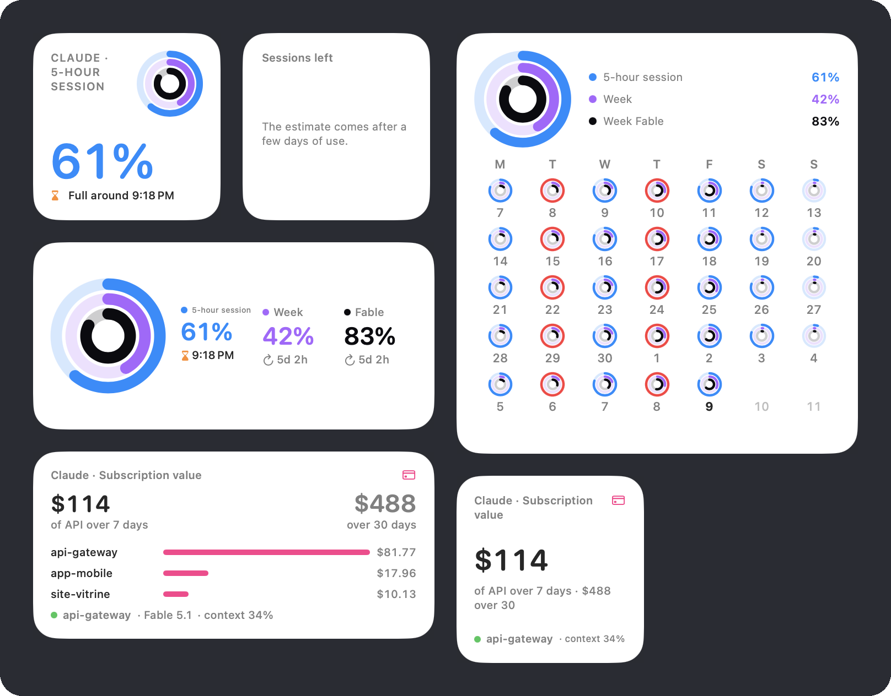

**Your Claude, Codex and Gemini limits, without opening Claude.**
Forecast, notifications, menu bar, notch, widgets, iPhone and Apple Watch, in one well-made app.

[**Download for Mac**](https://github.com/BenjaminSanchezPaper34/aijauge-releases/releases/latest) · [jaugeai.com](https://jaugeai.com) · [iPhone and Apple Watch](https://apps.apple.com/app/id6814973861)

```bash
brew install --cask benjaminsanchezpaper34/tap/jaugeai
```

## What it shows

- **Every limit of your plans**: Claude's 5-hour session, week and the capped model's week; Codex's session and week; Gemini's weekly pools. Three rings, the same everywhere.
- **Where you are heading**: "On track", or "Full around 4:33 PM", from your real pace, with what is left per day, and a notification before you hit the wall.
- **Your live session**: context size, its cost at API rates, and the right time to `/compact`.
- **What your plan is worth**: the work of the last days at API rates, per project.





On Apple Watch, turn the Digital Crown and the card moves between four layouts; the Light brightens the tip of each ring. The watch layouts, and the card layouts and the Light on iPhone, come with the next iPhone version.



## Free and Pro

- **Free**: the Mac app with its menu bar, notch, dashboard and desktop widgets; limits, pace, live session and notifications everywhere; the Apple Watch app (its four layouts with the next version).
- **JaugeAI Pro**, a one-time purchase in the iPhone app, one for all your devices (Family Sharing, 7-day trial):
  - on Mac: gauge colours and the Light, card layouts, the status line and banner in Claude Code, the voice connector, history for your agents;
  - on iPhone and Apple Watch: widgets, complications, Live Activity, history, advice, plan value, colours and layouts.

## Privacy

The Mac reads your limits locally and shares only the results through your own iCloud. No account, no password to type, no analytics, and no server unless you turn on the voice connector (Pro). The iPhone and Watch show what your Mac published.

## Requirements

macOS 26 or later. Claude Code, Codex or Google's Antigravity CLI signed in on the Mac. iPhone and Apple Watch on iOS 26 / watchOS 26, same iCloud account.

## Updates

The app updates itself (Sparkle, signed and notarized). This repository only hosts the downloads and `appcast.xml`, the update feed; the source code is not public.

---

**En français** : JaugeAI affiche les limites de vos forfaits Claude, Codex et Gemini dans la barre des menus, l'encoche, les widgets, sur iPhone et Apple Watch, sans ouvrir Claude. L'app Mac est gratuite ; JaugeAI Pro est un achat unique dans l'app iPhone. Plus d'informations sur [jaugeai.com](https://jaugeai.com).

JaugeAI is independent software, neither affiliated with nor endorsed by Anthropic, OpenAI or Google. Claude and Claude Code are trademarks of Anthropic, PBC; ChatGPT and Codex of OpenAI; Gemini and Antigravity of Google LLC.
